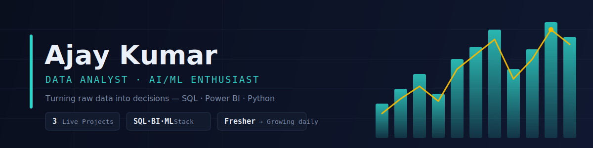
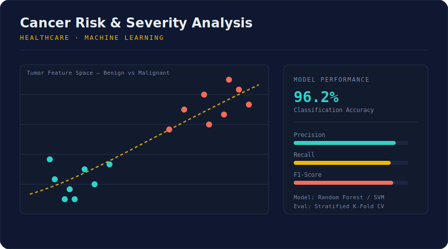
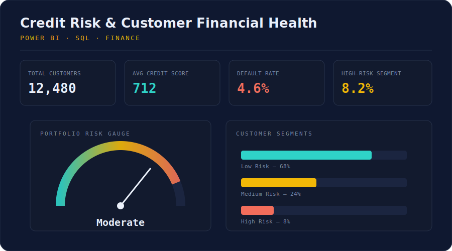
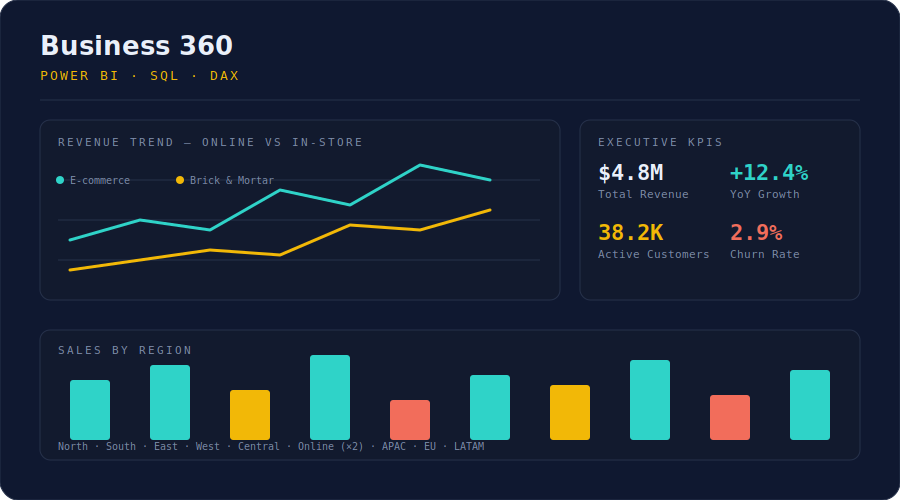
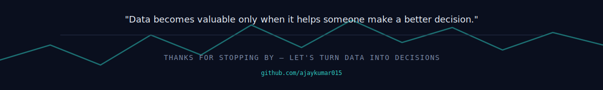

<div align="center">


<br>


<br><br>


</div>

---

# Hello 👋

I'm **Ajay Kumar**, a passionate **Data Analyst** and **AI/ML Enthusiast** who enjoys transforming raw data into meaningful business insights.

Rather than simply creating dashboards, I focus on solving real business problems through analytics, visualization, and machine learning.

Currently, I'm building projects that combine:

- 📊 Business Intelligence
- 🤖 Artificial Intelligence
- 📈 Data Analytics
- 🧠 Machine Learning
- 💻 SQL Optimization

---

## Philosophy

> **"Good decisions come from good data."**

I believe that every dataset tells a story. My goal is to uncover that story and transform it into actionable insights that help businesses make smarter decisions.

---

## Currently

```text
🎯 Looking for Data Analyst Opportunities

📚 Learning
  • Advanced SQL
  • Machine Learning
  • Python
  • Statistics
  • Data Visualization

🚀 Building
  • Cancer Risk & Severity Analysis
  • Credit Risk Analytics Dashboard
  • Business 360 Power BI Dashboard
```

---

<div align="center">

# Data → Insights → Decisions

</div>

---

## What you'll find here

✔ SQL Projects
✔ Power BI Dashboards
✔ Machine Learning Projects
✔ Python Analytics
✔ Business Case Studies
✔ End-to-End Data Projects

---

<div align="center">

### Turning Numbers Into Decisions

</div>

---

<!-- ====================================================== -->
<!-- ANALYTICS DASHBOARD -->
<!-- ====================================================== -->

<div align="center">

# 📊 Analytics Dashboard

<i>Transforming raw data into meaningful business insights.</i>

</div>

<br>

<table>
<tr>
<td width="50%" valign="top">

## 🧑‍💻 About Me

```yaml
Name: Ajay Kumar
Role: Data Analyst
University: Galgotias University
Experience: Fresher

Focus:
  - SQL
  - Power BI
  - Python
  - Excel
  - Machine Learning

Interested In:
  - Business Intelligence
  - Healthcare Analytics
  - Financial Analytics
  - AI Solutions

Current Goal:
  Becoming a Data Analyst who can solve
  real business problems using data.
```

</td>
<td width="50%" valign="top">

## 🎯 Career Focus

✔ Business Analytics
✔ Data Visualization
✔ Dashboard Development
✔ Machine Learning
✔ SQL Optimization
✔ Predictive Analytics
✔ Data Cleaning
✔ Business Reporting
✔ KPI Analysis
✔ Decision Support Systems

</td>
</tr>
</table>

---

# 🧰 Analytics Toolbox

<div align="center">


<br><br>


</div>

---

# 📈 Technical Skills

| Skill | Level |
|--------|-------|
| SQL | █████████░ 90% |
| Power BI | █████████░ 90% |
| Excel | ████████░░ 80% |
| PostgreSQL | ████████░░ 80% |
| MySQL | ████████░░ 80% |
| Python | ██████░░░░ 60% |
| Git | █████░░░░░ 50% |

---

# 🧠 What I Enjoy Working On

<table>
<tr>
<td width="33%">

### 📊 Data Analytics
- SQL Queries
- KPI Reporting
- Dashboards
- Business Insights
- Visualization

</td>
<td width="33%">

### 🤖 AI / ML
- Predictive Models
- Classification
- Healthcare Analytics
- Financial Risk
- Data Processing

</td>
<td width="33%">

### 💼 Business
- Customer Analytics
- Sales Analytics
- Credit Risk
- Healthcare Data
- Decision Making

</td>
</tr>
</table>

---

# 📚 Currently Learning

```text
Advanced SQL                 ████████████████████░ 90%
Power BI                     ██████████████████░░░ 85%
Python for Data Analytics    ██████████████░░░░░░░ 70%
Machine Learning             ████████████░░░░░░░░░ 60%
Git & GitHub                 ██████████░░░░░░░░░░░ 50%
```

---

<div align="center">

## 💡 My Approach

```
Collect Data
    │
    ▼
Clean & Prepare
    │
    ▼
Analyze Patterns
    │
    ▼
Build Dashboard
    │
    ▼
Generate Insights
    │
    ▼
Support Better Decisions
```

</div>

---

<div align="center">

> **"Data becomes valuable only when it helps someone make a better decision."**

</div>

---

<!-- ====================================================== -->
<!-- FEATURED PROJECTS -->
<!-- ====================================================== -->

<div align="center">

# 🚀 Featured Projects

<i>Projects that demonstrate my ability to solve real business problems using data, analytics, and machine learning.</i>

</div>

<br>

<table>
<tr>
<td width="50%">

## 🧬 Cancer Risk & Severity Analysis


### 📌 Overview
An end-to-end healthcare analytics project that predicts cancer risk and severity using machine learning techniques.

### ✨ Highlights
- Data Cleaning & Preprocessing
- Exploratory Data Analysis (EDA)
- Feature Engineering
- Classification Models
- Performance Evaluation
- Healthcare Insights

### 🛠 Tech Stack
Python • Pandas • NumPy • Scikit-learn • Matplotlib

### 🎯 Business Value
Supports data-driven healthcare decisions by identifying patient risk patterns.

</td>
<td width="50%">

</td>
</tr>
</table>

---

<table>
<tr>
<td width="50%">

</td>
<td width="50%">

## 💳 Credit Risk & Customer Financial Health Dashboard


### 📌 Overview
Interactive dashboard for analyzing customer financial health and identifying credit risk patterns.

### ✨ Highlights
- Customer Segmentation
- KPI Dashboard
- Risk Analysis
- Interactive Filters
- Financial Trends
- Executive Reporting

### 🛠 Tech Stack
Power BI • SQL • Excel

### 🎯 Business Value
Helps financial teams monitor customer behavior and support informed lending decisions.

</td>
</tr>
</table>

---

<table>
<tr>
<td width="50%">

## 📊 Business 360


### 📌 Overview
A business intelligence solution combining SQL, Power BI, Excel, and DAX to analyze sales performance across brick-and-mortar and e-commerce channels.

### ✨ Highlights
- Executive Dashboard
- Sales Analysis
- Customer Insights
- Revenue Trends
- Dynamic KPIs
- DAX Calculations

### 🛠 Tech Stack
Power BI • SQL • Excel • DAX Studio

### 🎯 Business Value
Provides business leaders with actionable insights for tracking performance and supporting strategic decisions.

</td>
<td width="50%">

</td>
</tr>
</table>

---

<div align="center">

# 📈 Project Highlights

</div>

| Project | Domain | Primary Skills |
|----------|--------|----------------|
| 🧬 Cancer Risk & Severity Analysis | Healthcare Analytics | Python, Machine Learning |
| 💳 Credit Risk Dashboard | Financial Analytics | SQL, Power BI, Excel |
| 📊 Business 360 | Business Intelligence | SQL, DAX, Power BI |

---

<div align="center">

### 🔍 What My Projects Demonstrate

</div>

- 📊 Data Cleaning & Transformation
- 📈 Dashboard Design
- 🧠 Analytical Thinking
- 📉 Business KPI Reporting
- 🤖 Machine Learning Fundamentals
- 💼 Business Problem Solving
- 📋 Insightful Data Storytelling

---

<div align="center">

> **"Great analytics doesn't just explain the past—it helps shape better decisions for the future."**

</div>

---

<!-- ====================================================== -->
<!-- GITHUB ANALYTICS -->
<!-- ====================================================== -->

<div align="center">

# 📈 GitHub Analytics

<i>Continuous learning. Consistent improvement. Building one project at a time.</i>

</div>

<br>

<p align="center">


</p>

<br>

<p align="center">

</p>

---

<div align="center">

# 🏆 GitHub Achievements

</div>

<p align="center">

</p>

---

<div align="center">

# 📊 Contribution Activity

</div>

<p align="center">

</p>

---

<div align="center">

# 🐍 Contribution Snake

</div>

<p align="center">

</p>

---

<div align="center">

# 💬 Daily Inspiration


</div>

---

<div align="center">

# 🌍 Visitor Counter


</div>

---

# 📌 Development Focus

<table>
<tr>
<td width="33%">

## 📊 Analytics
✔ SQL
✔ Power BI
✔ Excel
✔ Dashboards
✔ KPIs

</td>
<td width="33%">

## 🤖 AI
✔ Python
✔ Machine Learning
✔ Data Processing
✔ Prediction Models

</td>
<td width="33%">

## 🚀 Growth
✔ Open Source
✔ Portfolio Projects
✔ Business Analytics
✔ Continuous Learning

</td>
</tr>
</table>

---

<div align="center">

### Every project is another step toward becoming a better Data Analyst.

<br>



</div>
